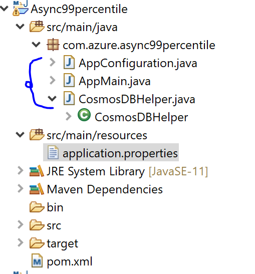

# Sample code to verify Azure Cosmos DB's performance (Percentile) for Java Async SDK (v3)
 This sample is written to demonstrate Blocking Async thread for individual request performance and Non-blocking Async thread for parallel execution of multiple threads.

##Operations defined in this example:
- Read & Write Operations which will be executed in Sequence using Observer.toBlocking(), these blocking method will have suffix in their name as blocking. The purpose of this method to demonstrate individual request's latency which will be showcased as P90, P95 & P99.
- Read & Write Operations which will be executed in Parallel using Observer.merge, these non-blocking methods will have suffix in their name as nonblocking. The purpose of this method to demonstrate latency when multiple request's executed in parallel which is demonstrated as overall latency. So, if we have 1000 requests then the latency will be demonstrated for time taken (in ms) to execute 1000 requests.
Before running this sample, please modify the file application.properties under resource folder as:
```JAVA
# Specify the DNS URI of your Azure Cosmos DB.
azure.cosmosdb.uri=https://<xxx>.documents.azure.com:443/

# Specify the access key for your database.
azure.cosmosdb.key=xxx

# Specify the name of your database.
azure.cosmosdb.database=xxx

# Specify the name of your collection.
azure.cosmosdb.collection=xxx

# Specify the number of operations to be executed.
azure.cosmosdb.numberofoperations=1000
```
In order to run this sample, you can specify the number of operations as an argument shown below:
```JAVA
  java -jar Async99percentile.jar 100
```
If you don't specify the number of operations then by default it will take 1000 operations.

### Code Structure
The code is divided into three classes:
1. AppConfiguration - This class will the configuration from application.properties file.
2. CosmosDBHelper - This class will hold all the methods to interact with Azure Cosmos DB. Consider this as a DAL.
3. AppMain - It is the primary class having the main method and control execution of all the methods performing tests.

